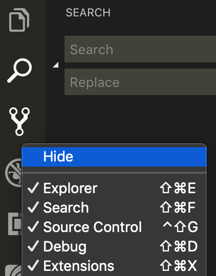

# Visual Studio Code

We'll be using Visual Studio Code as our primary text editor of choice. While it comes with a great set of default settings, we'll want to make a few adjustments to help maximize our learning during the course.

## Configuration

### Windows Subsystem for Linux Users

If you're using Windows 10 and enabled the Windows Subsystem for Linux feature, you need to tell Visual Studio Code to use your WSL Bash \(aka Ubuntu Bash or Linux Bash\) as its default integrated terminal. Follow the instructions at [https://stackoverflow.com/a/56225296/3814251](https://stackoverflow.com/a/56225296/3814251).

### Preferences

```javascript
{
  "editor.lightbulb.enabled": false,
  "editor.parameterHints.enabled": false,
  "editor.renderWhitespace": "all",
  "editor.snippetSuggestions": "none",
  "editor.tabSize": 2,
  "editor.wordWrap": "on",
  "emmet.showExpandedAbbreviation": "never",
  "files.trimTrailingWhitespace": true,
  "javascript.suggest.enabled": false,
  "javascript.updateImportsOnFileMove.enabled": "never",
  "javascript.validate.enable": false
}
```

### Install

* Live Share
  * Log in with your GitHub account when Live Share prompts you to do so.

### Disable

* Source Control from left Activity Bar sidebar
  * Right click the Git branch icon on the left Activity Bar sidebar, then `Hide`. This will prevent you from accidentally using non-terminal Git commands via Visual Studio Code.



* Source Control from bottom Status Bar
  * Open a Git repository with Visual Studio Code and right click the bottom status bar. Select `Source Control` so it becomes unchecked. This will prevent you from accidentally using non-terminal Git commands via Visual Studio Code.


### Banned

* Prettier
* Quokka
* Using Git from within the Visual Studio Code GUI is prohibited. You may use Git functionality only from within the terminal. \(If you're using Git via integrated terminal, that's fine.\)

